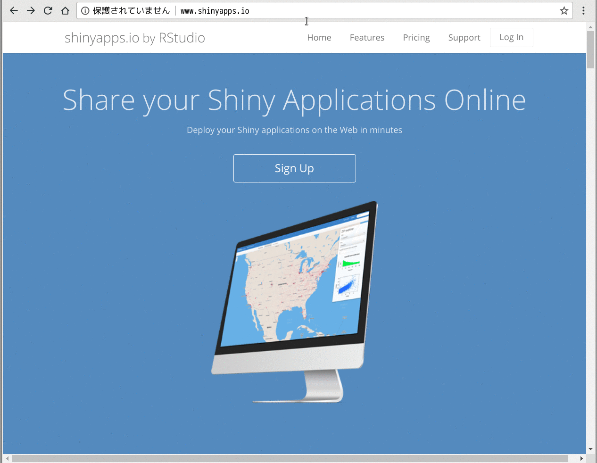

```{r setup, include=FALSE}
options(htmltools.dir.version = FALSE)
```

class: xlarge

# Who Are You

.pull-left[

<center></center>

- koshi ([@ksmzn](https://twitter.com/ksmzn))

- 株式会社ALBERT

- 頑張っていきましょう

- Rおじさん

- アナリスト -> エンジニア

- Rの仕事が無くなった

- Shinyおじさん

- 最近はReactを書いたりAWS触ったり。

]

.pull-right[

<center></center>

- ↑ マエショリの章を書きました。

- 新人研修にいいぞ

- 1人100冊ほど！お願いします！

]

---

# 最近作ったもの1  「ThankYouStars」

.pull-left[

- Rパッケージ。[CRAN](https://cran.r-project.org/web/packages/ThankYouStars/index.html) もあるよ

- インストール済の全ての  
  パッケージに対し、GitHubでスターを付けまくることが可能！

- スカッとしたい人におすすめ

]

.pull-right[


]

---

# 最近作ったもの2  「codicR」

- RStudioアドイン。
- `devtools::install_github("ksmzn/codicR")`
- 「[codic](https://codic.jp/)」のAPIを叩き、日本語を英語に変換する


---

# 最近作ったもの3  「HOXO-M Card」

- 名刺作成Shinyアプリ
- [https://ksmzn.shinyapps.io/hoxom-card/](https://ksmzn.shinyapps.io/hoxom-card/)
- 誰でも匿名知的集団ホクソエムを名乗れる夢アプリ
- Shiny+magick


---

# 「確率分布 Viewer 」

リニューアルしました。 [http://statdist.ksmzn.com/](http://statdist.ksmzn.com/)


---
class: xlarge

# 確率分布 Viewer とは？

- 確率分布をインタラクティブに触れるアプリ
- Shiny + shinydashboard + NVD3.js
- 確率分布のパラメータを切り替えてグラフの形状を調べられる
- 多くの確率分布に対応!
- 平均・分散も表示
- コード公開してます！PullRequest！お願いします！
  -> [https://github.com/ksmzn/ProbabilityDistributionsViewer](https://github.com/ksmzn/ProbabilityDistributionsViewer)
  


---

# DEMO


---
background-image: url("./img/shiny.svg")
background-size: 200px
background-position: 90% 8%


# Shinyとは？？？

.pull-left[

- https://shiny.rstudio.com/

- R言語でWebアプリを作れる  
  パッケージ

- HTMLやCSSの知識がなくても作れる（あると素敵）

- 分析結果の可視化や、ダッシュボードの作成が容易

- RStudioメンバーが作っている

]

.pull-right[
  
<br />
<br />
<br />
<br />


]


---

# 詳しくは

[@u_ribo](https://twitter.com/u_ribo) さんの資料を読もう！  
(もうこのスライドだけで良いんじゃないかな)

<center><a href="https://cdn.rawgit.com/uribo/talk_170722tokyor63/8836e635/slides/slide.html"></a></center>

---

# 本日は

- 先程のスライドの続編です

- Shinyの新機能をご紹介します

  - Bookmark
  
  - ShinyModule
  
- 自分がShinyアプリをつくる上で、便利だったパッケージをご紹介します

  - shiny.i18n


---

# 確率分布 Viewer 新機能紹介

新機能1: ブックマーク機能

<center></center>


---

# 確率分布 Viewer 新機能紹介

新機能1: ブックマーク機能

<center></center>


---

# 確率分布 Viewer 新機能紹介

新機能2: 英語・日本語切り替え機能


---
class: inverse, center, middle

# Bookmark 機能


---

# Bookmark 機能とは？

- ver0.14から追加された新機能

- Shinyアプリの状態をURLに保存できる

- 他の人に共有したいときに便利

- Shiny起動時にアプリの状態を復元する

- 状態とは、input。

- URLにinputを全て埋め込む方法と、Serverにファイルとして保存する方法が使える

---

# Bookmark ~ URL 埋め込み ~

もっとも単純でわかりやすい方法。
inputの値をクエリパラメータとして埋め込む。

```
http://statdist.ksmzn.com/?_inputs_&selected_language=%22Japanese%22
&norm-mean=0&norm-sd=1
```

アプリ起動時に、このURLの値をインプットとし、状態を復元する。  
パラメータが多いと、URLが長くなってしまう。


---

# Bookmark ~ Server保存 ~

ShinyServerにディレクトリを作り、inputをRDSファイルに保存する。
state_idがURLに埋め込まれ、そのstate_idに対応したRDSファイルが保存される。

OSS版ShinyServerの場合、version 1.4.7以降が必要。
  shinyapps.ioはまだ対応していないらしい。


---

# Bookmarkのシンプル例

```r
ui <- function(request) {
  fluidPage(
    textInput("txt", "Enter text"),
    checkboxInput("caps", "Capitalize"),
    verbatimTextOutput("out"),
    bookmarkButton()
  )
}
server <- function(input, output, session) {
  output$out <- renderText({
    if (input$caps)
      toupper(input$txt)
    else
      input$txt
  })
}

shinyApp(ui, server, enableBookmarking = "url")
```

[shiny公式サイト](https://shiny.rstudio.com/articles/bookmarking-state.html)の例


---

# Bookmarkの書き方 (URL埋め込み) 

やることは2つ。

① uiのオブジェクトを関数にする

```r
ui <- function(request) {
  fluidPage(
    textInput("txt", "Enter text"),
    checkboxInput("caps", "Capitalize"),
    verbatimTextOutput("out"),
    bookmarkButton() # ブックマークボタン
  )
}
```

---

# Bookmarkの書き方 (URL埋め込み) 


② `enableBookmarking()` 関数を呼ぶか、  
`shinyApp()` 関数の引数に指定する

app.R

```r
shinyApp(ui, server, enableBookmarking = "url")
```

global.R

```r
enableBookmarking(store = "url")
```

server保存の場合、「url」でなく「server」に変更する。

---

# shinydashboardで使えるの？

使える。

shinydashboardは、メニューの開閉状態をinputとして格納している。  
inputに入れているということは、問題なくbookmark機能を使える。

 `sidebarMenu()` に `id` を指定する必要がある。

```r
sidebarMenu(id = "sidebar",
  ....
)
```

---

# Bookmarkする値を選べるの？

 `setBookmarkExclude()` で除外できる。

デフォルトでは全てのinputをブックマークしてしまう。
大きなアプリの場合、URLが長くなるし復元がに時間がかかる。

除外したいinputを `setBookmarkExclude` 関数で指定する。

```r
setBookmarkExclude(c("x", "y"))
```

`input$x` と `input$y` はブックマーク対象から外れる。


---

# さらにBookmark機能を使う

様々なタイミングで実行されるcallbackが用意されている。

#### ブックマークする前

- `onBookmark`

#### ブックマークした後

- `onBookmarked`

#### 復元する前

- `onRestore`

#### 復元した後

- `onRestored`

---

# Bookmark まとめ

- Shinyの状態を保存できる機能

- URLに全てinputを埋め込む方法と、
  ServerにRDSファイルを保存する方法がある

- `setBookmarkExclude()` でinputする値を除外できる。

- callbackを使いこなすことによって、
  カスタマイズが可能


---
class: inverse, center, middle

# ShinyModule

### アプリを分割する


---

# ShinyModuleとは

- ちっちゃなui.R, server.Rのようなもの。
- [バージョン0.13.0から追加](https://blog.rstudio.com/2016/01/20/shiny-0-13-0/) 。

# ShinyModuleは何が嬉しいのか

- 関数のように再利用できる。
- 似たようなパーツを作る際にコピペせずに済む。
- 複数タブで似たようなページを持つアプリで特に便利（shinydashboard！）
- input, outputの名前空間をいい感じに管理してくれる。

関数をよりShinyに特化したものがShinyModuleというイメージ。

---

## 名前空間がやばい

Shinyアプリが大きくなってくると、input・outputのID管理が大変になる


---

## 名前空間がやばい

Shinyアプリが大きくなってくると、input・outputのID管理が大変になる


---

## 名前空間がやばい

でも実は、データが違うだけで右と左は同じ構造をしている。


---

## 名前空間がやばい

ShinyModuleを使えば、名前空間の管理がらくらくになる


---

## `shiny::NS()` で名前空間を管理する

`shiny::NS` 関数は、識別するための文字列を渡すと、Namespace（名前空間）を管理してくれる関数を返す。

```r
> ns <- shiny::NS('result1')
> ns('plot')
[1] "result1-plot"
```

---

# ShinyModule ~ 基本の書き方 ~

- UI部分のModuleとServer部分のModuleが必要
- UI側は末尾が `Input` , `Output` , `UI` のいずれか
- Server側はそれらの末尾文字列を消したものと同名（か、「Server」をつける）。

```r
# UI
irisPlotUI <- function(){
  # UIロジック
}
  
# Server
irisPlot <- function(){
  # Serverロジック
}
```

---

# ShinyModule実例 〜 Module無し 〜

.pull-left[

irisのヒストグラムを作るShinyアプリ。

上側にPetal, 下側にSepalの、それぞれ Length か Width のヒストグラムを表示する。

]

.pull-right[


]


---

# ShinyModule実例 〜 Module無し 〜

ShinyModuleを使わずに書く

```r
library(shiny)

ui <- fluidPage(
  selectInput('petal_col', '列：', c('Petal.Length', 'Petal.Width')),
  plotOutput('petal_plot'),
  selectInput('sepal_col', '列：', c('Sepal.Length', 'Sepal.Width')),
  plotOutput('sepal_plot')
)
server <- function(input, output, session) {
  output$petal_plot <- renderPlot({
    hist(iris[, input$petal_col])
  }) 
  output$sepal_plot <- renderPlot({
    hist(iris[, input$sepal_col])
  }) 
}
shinyApp(ui, server)
```

---

# ShinyModuleを作る ~ UI ~

selectInputとplotを出力するModuleを書く.  

1. 第一引数にidを書く
1. `ns` を作成する
1. inputIDを `ns` 関数で包む

```r
irisPlotUI <- function(id, cols) {
  ns <- NS(id)
  
  tagList(
    selectInput(ns('col'), '列：', cols),
    plotOutput(ns('plot'))
  )
}
```
    
---

# ShinyModuleを使う ~ UI ~

 `irisPlotUI` を呼び出し、id と その他の引数を渡す

```r
ui <- fluidPage(
  irisPlotUI('petal', c('Petal.Length', 'Petal.Width')),
  irisPlotUI('sepal', c('Sepal.Length', 'Sepal.Width'))
)
```

    
---

# ShinyModuleを作る ~ Server ~

通常のServerの書き方に近い。  
引数はinput, output, sessionをはじめに書く必要がある。

```r
irisPlot <- function(input, output, session, main){
  output$plot <- renderPlot({
    hist(iris[, input$col], main = main)
  }) 
}
```

`ns` 関数はここでは使わない。
呼び出す際に、勝手にoutputIDを管理してくれる。

    
---

# ShinyModuleを使う ~ Server ~

server側の書き方は、少し特殊。  
`callModule` 関数の第一引数に Module名、第二引数にid, 第三引数以降にはそのModuleで必要な値を渡す。

```r
server <- function(input, output, session) {
  callModule(irisPlot, "petal", "Petal Plot")
  callModule(irisPlot, "sepal", "Sepal Plot")
}
```

---

```r
library(shiny)

irisPlotUI <- function(id, cols){
  ns <- NS(id)
  tagList(
    selectInput(ns('col'), '列：', cols),
    plotOutput(ns('plot'))
  )
}
irisPlot <- function(input, output, session, main){
  output$plot <- renderPlot({
    hist(iris[, input$col], main = main)
  }) 
}

ui <- fluidPage(
  irisPlotUI('petal', c('Petal.Length', 'Petal.Width')),
  irisPlotUI('sepal', c('Sepal.Length', 'Sepal.Width'))
)
server <- function(input, output, session) {
  callModule(irisPlot, "petal", "Petal Plot")
  callModule(irisPlot, "sepal", "Sepal Plot")
}

shinyApp(ui, server)
```

---

# ShinyModule はどこに書けばいいんですか

`global.R` がおすすめ。

「確率分布Viewer」では、`modules.R`というファイルにmoduleを書き、
`global.R` で読み込んでいる。

---

# ShinyModule + shinydashboard

タブページやshinydashboardを使ったページのように、  
同じようなページをたくさん作る場合、ShinyModuleは重宝する


---

# ShinyModule + Bookmark

当然、BookmarkはModuleに対しても機能する。  
`onBookmark` などは、Module内部でも定義できる。  
Moduleごとにexcludeする値を決められる

```r
capitalizer <- function(input, output, session) {
  output$out <- renderText({
    toupper(input$text)
  })
  onBookmark(function(state) {
    state$values$hash <- digest::digest(input$text, "md5")
  })
}
server <- function(input, output, session) {
  callModule(capitalizer, "tc")
  output$out <- renderText({
    input$text
  })
  onBookmark(function(state) {
    state$values$hash <- digest::digest(input$text, "md5")
  })
}
shinyApp(ui, server, enableBookmarking = "url")
```

---

# ShinyModule まとめ

- アプリが大きくなってきたら Module化を検討する
- Moduleとは、ちいさなui, serverのようなもの
- `shiny::NS` により、名前空間管理が容易に
- shinydashboardと併用すると便利
- Bookmark機能も使える

---
class: inverse, center, middle

# shiny.i18n

### Shinyアプリを国際対応したい

---

# shiny.i18nとは

- i18nはinternationalization（国際化）の略
- `i` と `n` の間に18文字あるから i18n
- shiny.i18nはshinyで言語切り替えできるようにするパッケージ
- [Appsilon](https://appsilondatascience.com/) 製


---

# shiny.i18n の使い方

- は無いのでソースとサンプルアプリのコードを読む
- やってることは非常に単純
- 文言の対応表をCSVかJSONを用意する
- それをDataFrameとして読み込み、
- ShinyのInputに応じて出力列を変える


---

# JSONの例

```r
{
  "cultural_date_format": "%d-%m-%Y",
  "languages": [
    "en",
    "pl",
    "jp"
  ],
  "translation": [
    {
      "en": "Hello Shiny!",
      "pl": "Witaj Shiny!",
      "jp": "こんにちは、Shiny!"
    },
    {
      "en": "Histogram of x",
      "pl": "Histogram x",
      "jp": "xのヒストグラム"
    },
    :
    :

```

---

# shiny.i18n 使い方

Translatorクラスが用意されている

```r
> library(shiny.i18n)
> translator <- Translator$new(translation_json_path = "./data/translation.json")
> translator$translate("Hello Shiny!")
[1] "Hello Shiny!"

# 日本語に切り替え
> translator$set_translation_language('jp')
> translator$translate("Hello Shiny!")
[1] "こんにちは、Shiny!"
```

---

# 確率分布Viewerの翻訳

- こんな感じで泥臭く書いている
- PullRequest！お待ちしてます！


---
background-image: url("./img/appsilon.png")
background-size: 200px
background-position: 90% 8%

# Appsilonとは？？？？

- shinyのパッケージをたくさん作っている
  ~~謎の匿名知的集団~~ ポーランド企業


---

# Appsilon のShinyパッケージ

- 開発そんなに活発ではないので、  
  コントリビュートのチャンス！
- 個人的にはshiny-routerは面白い


---

# shiny.i18n まとめ

- アプリが大きくなってきたら Module化を検討する

- Moduleとは、ちいさなui, serverのようなもの

- `shiny::NS` により、名前空間管理が容易に

- shinydashboardと併用すると便利

- Bookmark機能も使える

---
class: inverse, center, middle

# Shinytest

### Shinyアプリをテストしたい

---
class: center, middle

# これは次の機会に紹介します！

---

# Shinyアプリが壊れる

- コードを変更した

- Rをアップグレードした

- Shinyをアップグレードした

- パッケージをアップグレードした

- データを追加した

## -> Shinytestでテストしよう！

---

# Shinytestとは?

- アプリをコードで操作し、動作をテストする

- 特定時点の画面を記録できる（アプリの正常な状態）

- フロントエンドでいうところのスナップショットテスト

- テストを実行すると、同じ操作してスナップショットをとり、
  正常な画面と比較する


---

# Shinytestの注意点

.pull-left[

- ShinyModuleとうまく動かない

- shinydashboardと相性が悪い
  
- 僕はほとんど使えず。。。

- 開発停滞気味？  
  -> 最近はWinston Chang氏がひとりで頑張ってる  
  -> コントリビュートチャンス？

  
]

.pull-left[


]


---

# まとめ

- Bookmark機能でShinyアプリを共有しよう！

- アプリが大きくなってきたら ShinyModuleを使おう！

- 国際化したいときはshiny.i18nを使おう！

- Shinytestでテストしよう！


---

class: inverse, middle, center
background-image: url(http://blog-imgs-92.fc2.com/l/i/v/livesense/1299664817ax.jpg)
background-size: contain


